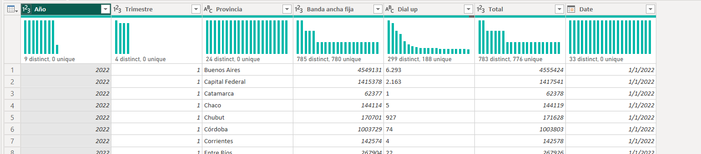
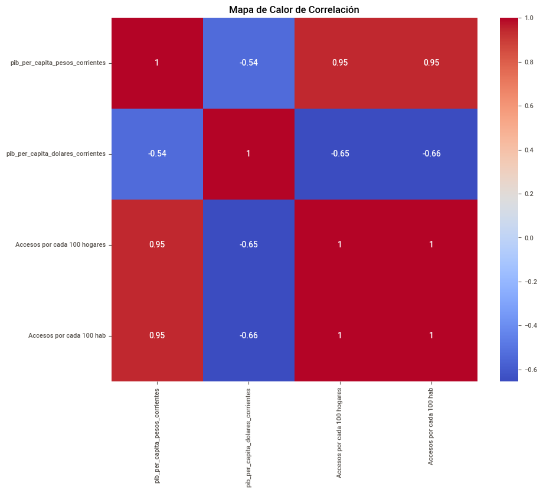
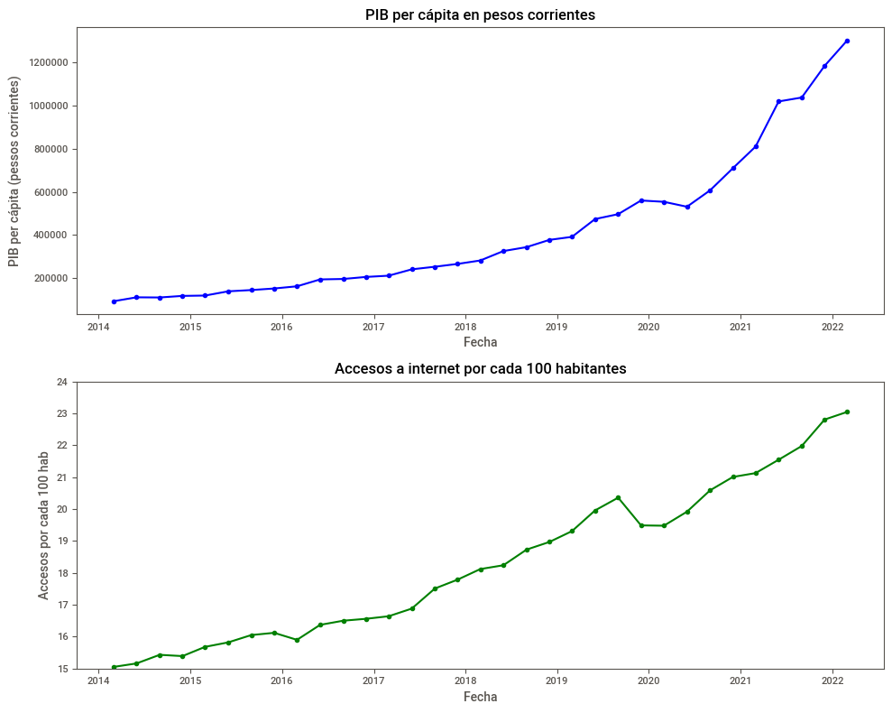

# **Análisis del acceso a internet en Argentina**

## **`Introducción:`**

La relación entre el acceso a Internet en Argentina y el PBI per cápita (Producto Bruto Interno per cápita) puede ser compleja y multifacética. Aunque no existe una relación directa de causa y efecto entre estos dos indicadores, el acceso a Internet puede tener un impacto positivo en el desarrollo económico y el bienestar de un país. A continuación, exploraré algunos puntos relevantes sobre esta relación:

1. Acceso a la información: Internet brinda acceso a una amplia gama de información y conocimiento, lo que puede promover la educación, la innovación y la productividad. Un mayor acceso a la información puede facilitar el desarrollo de habilidades y conocimientos necesarios para el crecimiento económico.

2. Oportunidades comerciales: Internet proporciona un canal para la expansión de negocios y el comercio electrónico. Las empresas pueden aprovechar el alcance global de Internet para llegar a nuevos mercados, aumentar sus ventas y generar empleo. Un mayor acceso a Internet puede facilitar el desarrollo de emprendimientos y fomentar la creación de empleo.

3. Inclusión financiera: Internet también puede promover la inclusión financiera al facilitar el acceso a servicios bancarios y financieros. La disponibilidad de servicios en línea puede ayudar a las personas a administrar sus finanzas, acceder a crédito y participar en actividades económicas formales.

4. Conectividad rural: En muchos casos, las áreas rurales tienen acceso limitado a servicios básicos y oportunidades económicas. La expansión de la infraestructura de Internet en estas áreas puede mejorar la conectividad y abrir nuevas posibilidades en sectores como la agricultura, el turismo y los servicios en línea.

5. Brecha digital: Sin embargo, es importante tener en cuenta que la falta de acceso a Internet puede agravar la brecha digital y la desigualdad económica. Aquellos que no pueden acceder a Internet o carecen de habilidades digitales pueden quedarse rezagados en términos de oportunidades económicas y acceso a servicios básicos.

Es importante destacar que estos puntos son generales y que cada país y contexto específico pueden tener variaciones en la relación entre el acceso a Internet y el PBI per cápita. Además, otros factores, como la infraestructura, la educación, las políticas gubernamentales y la estabilidad económica, también influyen en el desarrollo económico de un país.

## **`Contenido del repositorio:`**
- Carpeta images: contiene las imágenes que se cargan en el readme.
- Dashboard.pbix: informe de gráficos del análisis realizado.
- Carpeta datasets: contiene los archivos de datos en formato .csv.
- EDA.ipynb: análisis de datos en lenguaje python.

## **`Fuente de información:`**

- Datos del acceso a internet: Fuente primaria: Ente Nacional de Comunicaciones (ENACOM), URL: https://datosabiertos.enacom.gob.ar/dashboards/20000/acceso-a-internet/
- Datos de PBI per cápita en dólares y pesos: Fuente primaria: Instituto Nacional de Estadística y Censos (INDEC), URL: https://datos.gob.ar/dataset/sspm-producto-interno-bruto-dolares-producto-interno-bruto-per-capita-poblacion.

## **`Análisis de datos:`**

- Realizamos la visualización del contenido y tipo de datos de todos los datasets para saber con cuáles trabajar.

- En PowerQuery de PowerBI podemos observar información de los datos que contienen la tablas, por ejemplo: valores con error, vacíos, valores únicos, etc.

- Utilizando un heatmap encontramos una relación proporcional entre el aumento del PBI per cápita en pesos y el aumento del acceso a internet en hogares. 

- Focalizándonos en la relación anterior podemos observar como se demuestra mediante la representación gráfica de los datos.

## **`Transformación de datos:`**

- Del dataset de PBI per cápita realizamos unas transformaciones para crear las columnas Año y Trimestre y eliminar las columnas que no vamos a utilizar, todo esto con lenguaje Python, y así poder comparar el nivel de acceso a internet por habitantes con el PBI.

- Creamos una tabla calendario y relacionamos la columna Date con la de las demás tablas en PowerBI.

- Creamos las medidas necesarias para nuestros KPIs:
    + Goal_Fibra, Goal_Penetracion y Goal_Velocidad: son utilizadas como valores objetivos para los KPIs.
    + Promedio_Fibra, Promedio_Penetracion y Promedio_Velocidad: son utilizadas como promedio de los valores que corresponden por su nombre.
    + Promedio_Fibra_TP, Promedio_Penetracion_TP y Promedio_Velocidad_TP: son utilizadas como promedio de los valores del trimestre anterior que corresponden por su nombre.
    + Promedio_Fibra_ultima_fecha, Promedio_Penetracion_ultima_fecha y Promedio_Velocidad_ultima_fecha: son utilizadas como promedio de los valores de la última fecha que corresponden por su nombre.

## **`KPIs:`**

El proyecto cuenta con tres KPIs para realizar el seguimiento de sus objetivos:

- Variación de penetración respecto al trimestre anterior como indicador de inclusión digital: La penetración de acceso a Internet en hogares refleja el nivel de inclusión digital de una sociedad. Cuanto mayor sea el porcentaje de hogares con acceso a Internet, mayor será la disponibilidad de información, oportunidades educativas y acceso a servicios en línea, lo que promueve la igualdad de oportunidades y el desarrollo personal. A su vez la penetración de acceso a Internet en hogares también tiene un impacto directo en la economía. Un mayor acceso a Internet en los hogares puede facilitar el comercio electrónico, el teletrabajo y la creación de empresas digitales, lo que contribuye al crecimiento económico, la generación de empleo y la mejora de la productividad. Objetivo: mejorar en 1% el acceso a internet por cada 100 habitantes con respecto al trimestre anterior.

- Variación de la velocidad de descarga (Mbps) respecto al trimestre anterior: refleja el aumento o disminución en la velocidad de descarga de Internet experimentada por los usuarios. Una variación positiva indica mejoras en la velocidad de descarga, lo que implica una conexión más rápida y eficiente para los usuarios. Este avance en la calidad de conexión contribuye directamente a aumentar la satisfacción de los usuarios y promover una mayor adopción de Internet en los hogares. Objetivo: mejorar en 2% la velocidad de descarga en Mbps con respecto al trimestre anterior.

- Variación de usurios con fibra óptica respecto al trimestre anterior: La adopción y crecimiento de usuarios de fibra óptica contribuye directamente a aumentar la penetración de acceso a Internet en los hogares. La fibra óptica proporciona una conexión más rápida y confiable en comparación con otras tecnologías, lo que hace que sea más atractiva para los hogares que buscan una conexión de calidad. Objetivo: mejorar en 2% la cantidad de usuarios con fibra óptica con respecto al trimestre anterior.

## **`Conclusión:`**

Aunque el acceso a Internet no es la única variable determinante en el PBI per cápita de Argentina, puede desempeñar un papel significativo al promover la educación, la innovación, el comercio electrónico y la inclusión financiera. Sin embargo, es necesario abordar la brecha digital para garantizar que todos los sectores de la sociedad se beneficien de las oportunidades que brinda la conectividad en línea.